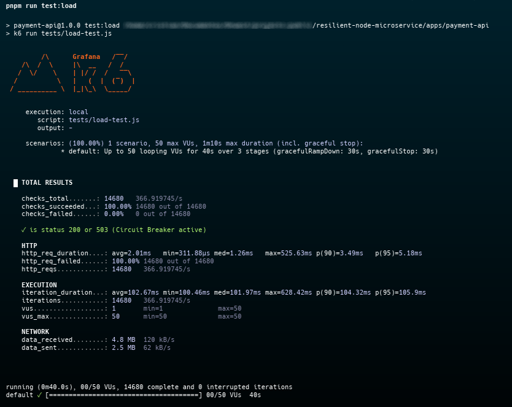

# 🛡️ Resilient Node.js Microservice Architecture


An enterprise-grade, production-ready microservice demonstrating advanced resilience patterns, observability, and modern Developer Experience (DX).

Production-grade Node.js microservice demonstrating resilience patterns used in distributed systems.

---

## 🎯 The Problem & The Solution

In distributed systems, external dependencies (like Payment Gateways or third-party APIs) will inevitably fail. This repository demonstrates how to build a Node.js microservice that **survives network partitions and external outages** without cascading failures.

---

## 🏗️ Architecture Overview

```text
                ┌───────────────┐
                │   Client App  │
                └───────┬───────┘
                        │ HTTP
                        ▼
               ┌──────────────────┐
               │   Payment API    │
               │     (Express)    │
               └────────┬─────────┘
                        │
                        ▼
                Circuit Breaker
                   (Opossum)
                        │
            ┌───────────┴───────────┐
            ▼                       ▼
   External Payment API      Fallback Response
   (Simulated failure)       503 Service Unavailable
```
---

## ☁️ Cloud Architecture & Deployment

This microservice is designed to be cloud-native. The infrastructure is provisioned using Terraform, targeting AWS ECS (Fargate) for scalable, serverless container execution. The architecture includes a custom VPC with private subnets for the compute layer, an Application Load Balancer (ALB) for traffic distribution, and Amazon ECR for image management. This setup ensures high availability, secure network isolation, and zero-downtime deployments.
```text
/terraform
  ├── environments/
  │   ├── dev/
  │   └── prod/
  ├── modules/
  │   ├── vpc/        
  │   ├── ecr/         
  │   └── ecs/          
  ├── main.tf
  ├── variables.tf
  └── outputs.tf
```
---

## 📦 Tech Stack

| Layer | Technology |
|------|-------------|
| Runtime | Node.js 20 |
| Language | TypeScript |
| Framework | Express |
| Resilience | Opossum (Circuit Breaker) |
| Validation | Zod |
| Logging | Pino |
| Monorepo | pnpm + Turborepo |
| Containerization | Docker |
| Load Testing | k6 |

---

## 🔄 Request Flow

1. Client sends a request to the **Payment API**.
2. The API calls an external **Payment Provider**.
3. The request is wrapped by a **Circuit Breaker**.
4. If the provider fails repeatedly:
   - The circuit transitions to **OPEN**.
   - Calls are short-circuited immediately.
5. After a cooldown period:
   - Circuit transitions to **HALF-OPEN**.
6. If the provider recovers:
   - Circuit returns to **CLOSED** state.

---

## 🛡️ Resilience Strategy

This microservice demonstrates several production-grade resilience patterns.

### Circuit Breaker

Implemented using **Opossum** to prevent cascading failures.

Benefits:

- Prevents excessive retries to failing services
- Protects Node.js event loop
- Reduces external API rate limit penalties

### Fail-Fast Configuration

Environment variables are validated using **Zod** at startup.

If configuration is invalid:

- The service fails immediately
- Prevents undefined behavior in production

### Graceful Shutdown

Handles:

- `SIGTERM`
- `SIGINT`

Ensuring:

- Active HTTP requests finish
- Database connections close safely
- Zero-downtime deployments in Kubernetes or ECS

---

## 📊 Observability

### Structured Logging

Logging is implemented with **Pino**, producing structured JSON logs.

Features:

- High-performance logging
- PII redaction
- Ready for aggregation systems such as:
  - Datadog
  - ELK Stack
  - Loki

Example log:

```json
{
  "level": "info",
  "service": "payment-api",
  "msg": "Payment processed",
  "requestId": "123abc"
}
```

---

## 🏗️ Project Topology

Structured as a monorepo to isolate domains and share configurations efficiently:

```text
.
├── apps/
│   └── payment-api/
│       ├── src/
│       ├── load-test/
│       └── .env.example
│
├── packages/
│   ├── eslint-config/
│   └── typescript-config/
│
├── turbo.json
├── pnpm-workspace.yaml
└── package.json
```

---

## 🚀 Getting Started

### Prerequisites

- Node.js >= 20.x
- pnpm >= 9.x
- Docker

### Local Development

```bash
# 1. Clone the repository
git clone https://github.com/dnwest/resilient-microservice.git

# 2. Enter the project
cd resilient-microservice

# 3. Install dependencies (Workspace root)
pnpm install

# 4. Setup environment variables
cp apps/payment-api/.env.example apps/payment-api/.env

# 5. Start the development server
pnpm run dev
```

---

## 🧪 Proving Resilience (Load Testing)

This repository includes a **k6 load test script** to simulate a traffic spike and demonstrate the Circuit Breaker in action.

Start the API in one terminal:

```bash
pnpm run dev
```

In a second terminal, execute the load test:

```bash
cd apps/payment-api
pnpm run test:load
```

Validates resilience behavior under load: `200` (CLOSED) and `503` (OPEN) without blocking the service.



When the simulated external API fails, the service immediately returns:

```
503 Service Unavailable
```

instead of blocking the Node.js event loop.

---

## 🐳 Docker

Build and run the production container:

```bash
# Build the optimized image
docker build -t payment-api:production .

# Run the container
docker run -p 3000:3000 --env-file apps/payment-api/.env payment-api:production
```

---

## 🚀 Future Improvements

- Retry with exponential backoff
- Distributed tracing (OpenTelemetry)
- Metrics with Prometheus
- Health check endpoints for Kubernetes
- Rate limiting for API protection

---

## 👨‍💻 Author

Cristian Fernandes  
Senior Software Engineer